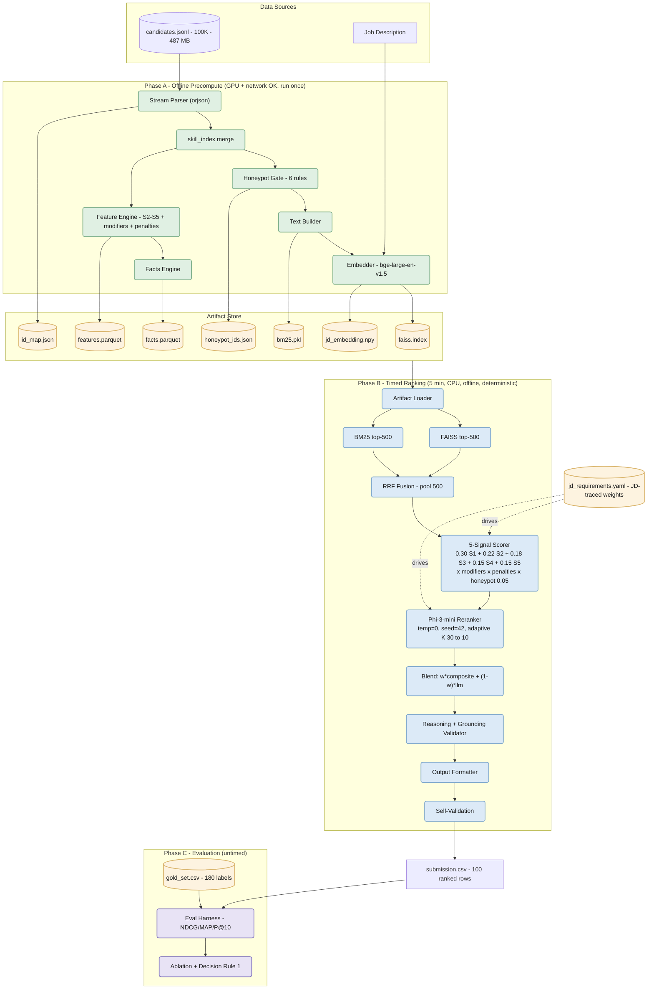
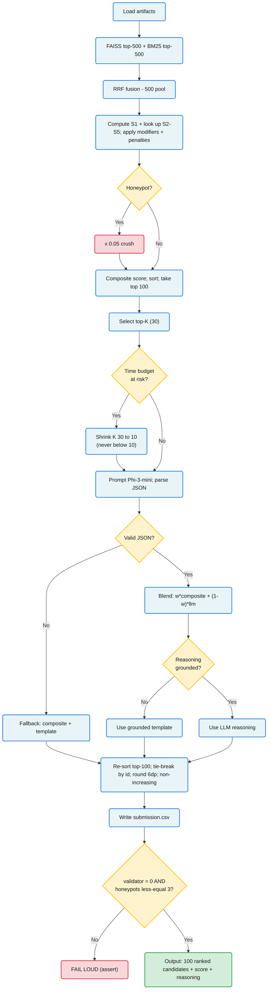

<div align="center">

# Aptus-R — Intelligent Candidate Ranking System

**Rank the 100 best-fit candidates out of 100,000 — in under 5 minutes, on CPU, fully offline.**

Dual retrieval (FAISS + BM25 → RRF) · 5-signal composite · local Phi-3-mini rerank · grounded reasoning · deterministic output

[](https://github.com/Mahakisore7/Red-Rob/actions/workflows/ci.yml)
[](https://github.com/Mahakisore7/Red-Rob/actions/workflows/repro.yml)


*Redrob × Hack2skill "India Runs" — Track 1: The Data & AI Challenge · Team Code Blooded*

</div>

---

## Table of contents

- [The problem](#the-problem)
- [Why Aptus-R wins](#why-aptus-r-wins)
- [Results at a glance](#results-at-a-glance)
- [System architecture](#system-architecture)
- [End-to-end workflow](#end-to-end-workflow)
- [How it works](#how-it-works)
- [Quickstart](#quickstart)
- [Constraint compliance](#constraint-compliance)
- [Repository layout](#repository-layout)
- [Testing & CI](#testing--ci)
- [Tech stack & rationale](#tech-stack--rationale)
- [Honesty, limitations & future work](#honesty-limitations--future-work)

---

## The problem

We are given **100,000 synthetic candidate profiles** and **one job description** — *Senior AI Engineer, Founding Team* (Pune/Noida, hybrid, 5–9 yrs). We must output **exactly 100 candidates, ranked best-first**, each with a score and a one-line reason.

The dataset is **adversarial by design**. The organizer's own `sample_submission.csv` ranks an **HR Manager at #1** because it scores by *AI-skill-count × recruiter-response-rate* — pure keyword counting with no concept of role fit. **Beating that naive baseline is the entire challenge**, and the data hides four traps:

| Trap | Example | Aptus-R defence |
|---|---|---|
| **Honeypots** (~80) | "expert in 10 skills, 0 months used" | 6-rule integrity gate → ×0.05 |
| **Keyword stuffers** | HR Manager listing 10 AI skills at "expert" | role-coherence (S2) + assessment-contradiction rule |
| **Plain-language experts** | built a "search backend", never writes "RAG" | semantic retrieval (S1) + concept thesaurus |
| **Behavioral twins** | identical on paper, one dormant | recency (S4) + intent (S5) |

The **ranking step** must run in **≤ 5 min, CPU-only, no network, ≤ 16 GB RAM, deterministically**.

## Why Aptus-R wins

- **Meaning over keywords** — semantic retrieval surfaces genuine experts even when they never use the buzzword.
- **Verify before scoring** — a 6-rule gate removes planted "impossible" profiles *before* they can rank.
- **Trajectory over title; availability as a multiplier** — a career *moving toward* the role beats a coincidental keyword; dormant perfect-fits sink but are never zeroed.
- **Measured, not guessed** — every weight traces to a JD line and is validated by an eval harness (NDCG/MAP/P@10).
- **100% local, offline, deterministic** — no hosted API on the ranking path; the same input always yields a byte-identical CSV.

## Results at a glance

Internal weak-ground-truth ablation (challenge score = `0.50·NDCG@10 + 0.30·NDCG@50 + 0.15·MAP + 0.05·P@10`):

| Ranker | NDCG@10 | NDCG@50 | MAP | P@10 | **Challenge score** |
|---|---|---|---|---|---|
| Naive (the sample-submission trap) | 0.442 | 0.551 | 0.635 | 0.400 | **0.502** |
| Title-only | 0.927 | 0.885 | 0.773 | 0.900 | 0.890 |
| **Composite (S1–S5)** | 1.000 | 0.890 | 0.849 | 1.000 | **0.944** |
| Composite + Phi-3 (w=0.70) | 1.000 | 0.894 | 0.856 | 1.000 | 0.947 |

> Aptus-R roughly **doubles** the naive baseline. Its **top-10 are genuine Senior AI/ML/NLP/Recsys engineers at product companies** (Nykaa, LinkedIn, PharmEasy, Krutrim…) — where the naive baseline put an HR Manager at #1. **0 honeypots** in the top-100.
>
> ⚠️ **Honest caveat:** the gold labels are weak/auto-bootstrapped and correlated with S1, so the absolute composite scores are partly circular. The *naive-vs-composite gap is robust*; the precise numbers need human-corrected labels (see [`eval/labeling_rubric.md`](./eval/labeling_rubric.md)). No weights were tuned on these labels for that reason.

## System architecture

Two zones hinged on a versioned **artifact store**: everything slow and heavy happens **once, offline** (GPU + network allowed); the **timed ranking step** only loads artifacts and does fast math + a few local LLM calls.



## End-to-end workflow

The runtime decision flow — note the four control points that make it robust: **honeypot crush, adaptive time gate, malformed-JSON fallback, grounding validator**.



## How it works

### 1. Two-phase design
The timed step can't embed 100K profiles (that's ~an hour), so **Phase A** does all heavy work once and writes 7 artifacts; **Phase B** just loads them. Phase B imports **no** embedder / torch / network library — it reads the precomputed `jd_embedding.npy`. This is what makes "≤5 min, CPU, offline" achievable while still using a 1024-d transformer for quality.

### 2. Dual retrieval + RRF
`bge-large-en-v1.5` (1024-d, normalized) in a FAISS `IndexFlatIP` gives **exact cosine** → top-500. `BM25Okapi` gives lexical top-500. **Reciprocal Rank Fusion** (`Σ 1/(60+rank)`) merges them into a 500-candidate pool — rank-based, so no score normalization needed. Dense catches meaning; sparse catches exact keywords.

### 3. The 5-signal composite
```
composite = 0.30·S1 + 0.22·S2 + 0.18·S3 + 0.15·S4 + 0.15·S5
final     = composite × notice × location × salary × work
                      × consulting(0.60) × title_chaser(0.75) × no_product(0.70)
                      × honeypot(0.05)
```
- **S1 Semantic** `clip((cosine−0.30)/0.65,0,1)` — role alignment.
- **S2 Career-arc** — past roles embedded vs 3 JD anchors, recency-weighted `[1,0.8,0.6,0.4,0.2]`.
- **S3 Behavioral** — recruiter saves, search appearances, completeness, GitHub, endorsements.
- **S4 Recency** `exp(−0.005·days_inactive)`.
- **S5 Intent** — open-to-work, applications, response rate, interview completion, verified contact.

### 4. The 6-rule honeypot gate
Flag (don't delete) → ×0.05 + terminal assertion (≤3 in top-100): expert-with-0-months, career-math mismatch, too-many-experts, perfect-score-no-verification, keyword-stuffer, assessment-contradiction. Result: **0 honeypots** in the final top-100.

### 5. Local LLM rerank (deterministic + bounded)
The top-K go to a local **Phi-3-mini** (q4 GGUF, CPU) for a fit score + grounded reason. It is (a) **deterministic** (`temperature=0, seed=42, n_threads=1`), (b) **time-bounded** — an adaptive gate shrinks K `30→10` if the budget is at risk, never below 10, and (c) **fail-safe** — malformed JSON falls back to the composite + template. A **grounding validator** re-checks every fact against the record; anything unverifiable is replaced by a template → *zero hallucination by construction*.

## Quickstart

Toolchain is **[uv](https://docs.astral.sh/uv/)** (fast, reproducible, locked).

```bash
# 0) one-time env
uv sync --frozen                       # lean runtime (what the timed step uses)
uv sync --all-extras --dev             # full dev env (adds embedder, sandbox, tooling)

# Phase A — offline, once (network + GPU OK, untimed): builds artifacts/
uv run aptus-precompute --candidates data/candidates.jsonl --device cuda

# Phase B — the timed submission step (≤5 min, CPU, offline, deterministic)
uv run aptus-rank --candidates data/candidates.jsonl --out submission.csv            # composite (≈3 s)
uv run aptus-rank --candidates data/candidates.jsonl --out submission.csv --use-llm  # + Phi-3 (≈207 s)

# Phase C — internal eval (untimed)
uv run aptus-eval --submission submission.csv --gold eval/gold_set.csv
```

Models are downloaded once in Phase A (`bge-large-en-v1.5`, `Phi-3-mini-4k-instruct` GGUF). Live demo: `sandbox/streamlit_app.py` (paste ≤100 candidate JSON records → ranked table + per-signal breakdown).

## Constraint compliance

Measured for the timed `aptus-rank` step:

| Constraint | Limit | Measured |
|---|---|---|
| Wall-clock | ≤ 5 min | **3 s** composite · **207 s** with Phi-3 rerank |
| RAM peak | ≤ 16 GB | ~5 GB |
| Network (ranking) | none | none — no embedder/HTTP libs on the path |
| Compute | CPU-only | CPU-only (GPU used only for offline Phase A) |
| Output | exactly 100 | 100, `validate_submission.py` returns 0 |
| Honeypots in top-100 | ≤ 10% | **0** |
| Determinism | byte-identical | ✅ verified across 2 runs (both paths) |

Phase-A precompute (untimed): full 100K embed in **~58 min on an RTX 4050**.

## Repository layout

```
src/aptus/                # importable package (src-layout)
├── config.py             # loads YAML weights, paths, seeds
├── schema.py             # Candidate model, skill_index(), full_text()
├── honeypot.py           # 6-rule integrity gate
├── dataio.py             # streaming jsonl loader
├── embedder.py           # bge-large wrapper (precompute-only)
├── retriever.py          # FAISS + BM25 + RRF + artifact loader
├── signals.py            # S1–S5, modifiers, penalties, blend
├── scorer.py             # composite assembly + ranking
├── llm_reranker.py       # Phi-3-mini, adaptive gate, JSON fallback
├── reasoning.py          # grounded reasoning + grounding validator
├── output_formatter.py   # CSV, tie-break, self-validation
├── features.py / facts.py / eval_metrics.py / jd.py / textproc.py / errors.py / logging_setup.py
└── cli/                  # precompute.py · rank.py · eval.py  (console scripts)
config/                   # jd_requirements.yaml · concept_thesaurus.yaml · title_taxonomy.yaml · job_description.md
eval/                     # gold_set.csv · labeling_rubric.md · eval_report.md
sandbox/                  # streamlit_app.py (HF Spaces demo)
scripts/                  # dataio, honeypot_full_scan, build_gold_set, run_ablation
tests/                    # 116 tests · 95% coverage
docs/  phases/            # PRD, TRD, architecture, phase-by-phase build plan
```

## Testing & CI

- **116 tests, 95% coverage** — ruff (lint), mypy (`--strict`), pytest, all gated in CI.
- **`ci`** workflow: lint + type-check + tests on every push/PR.
- **`repro`** workflow: end-to-end **determinism** (rank twice → byte-identical) + offline checks.
- **pre-commit** hooks mirror CI locally; every weight lives in one JD-annotated YAML for one-line, git-diffable tuning.

```bash
uv run ruff check . && uv run mypy src/aptus && uv run pytest
```

## Tech stack & rationale

| Layer | Choice | Why |
|---|---|---|
| Env | Python 3.11 + **uv** | reproducible, locked (`uv.lock`) |
| Embeddings | **bge-large-en-v1.5** (1024-d) | top-tier recall; precompute is untimed so size is free |
| Dense search | **FAISS-cpu** `IndexFlatIP` | exact cosine on 100K×1024 |
| Sparse search | **rank-bm25** | lexical recall the dense side misses |
| Fusion | **RRF** | scale-free, no score normalization |
| Ranker | hand-weighted composite | ~180 labels would overfit a learned ranker; transparent + defensible |
| Rerank LLM | **Phi-3-mini q4 GGUF** via llama.cpp | local, CPU, deterministic → satisfies "no API / offline" |
| Storage | pandas + pyarrow (Parquet) | fast precomputed feature/fact tables |
| Config | single **YAML** | one-line tuning, JD-traced, Stage-5 defensible |
| Quality | ruff · mypy(strict) · pytest · GitHub Actions | 95% coverage + determinism/offline CI |
| Demo | Streamlit on HF Spaces | reuses the exact scoring code path |

## Honesty, limitations & future work

We optimize for a **defensible** system, so we state the gaps plainly:

- **Weak eval labels.** The gold set is auto-bootstrapped and reuses S1, so absolute eval numbers are partly circular. *Fix:* two-labeller human WGT with Cohen's κ (protocol in `eval/labeling_rubric.md`), then re-run the ablation.
- **`salary_mod` is a heuristic**, not JD-grounded — the JD states no salary band. Flagged in `config/job_description.md`; a candidate to drop/tune in Phase 4.
- **Honeypot gate over-flags** (220 vs the organizer's ~80) because rule FR-7e also catches keyword-stuffers — a broader trap class. Calibration is a noted follow-up; it does not affect the top-100 (0 honeypots).
- **Adaptive K is timing-dependent** across machines; for absolute cross-machine reproducibility, K can be pinned after a timing dry-run.
- **Unmodeled JD disqualifiers** (research-only, "recent-LangChain-only", CV/speech without NLP) are candidate future penalties.

---

<div align="center">

**Aptus-R** — meaning over keywords · verified before scored · every weight measured.
Built by **Team Code Blooded** · MIT licensed.

</div>
