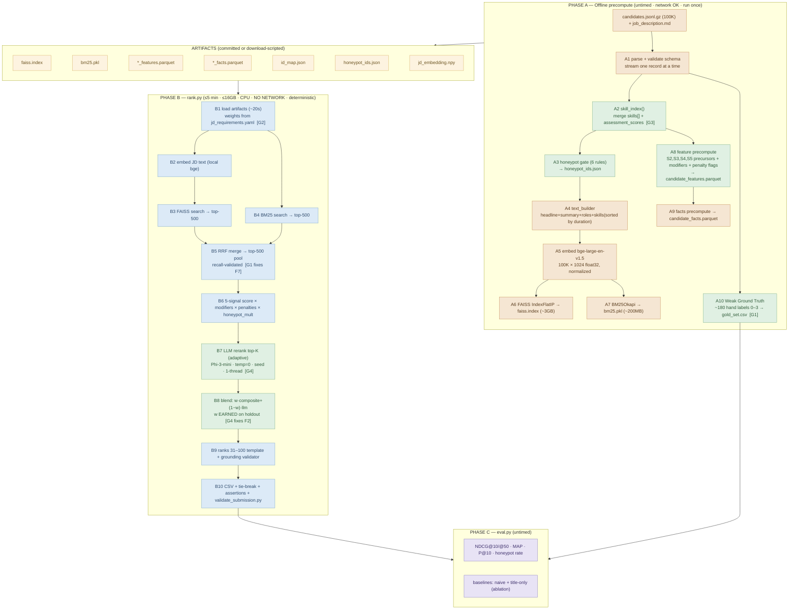
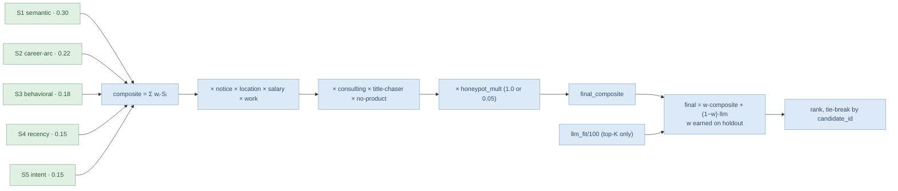
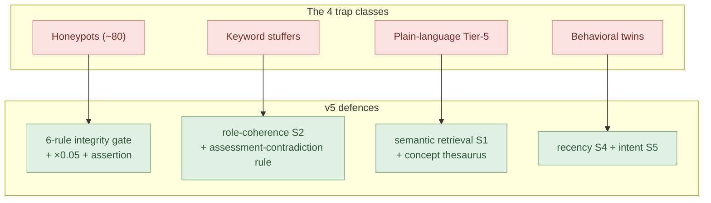
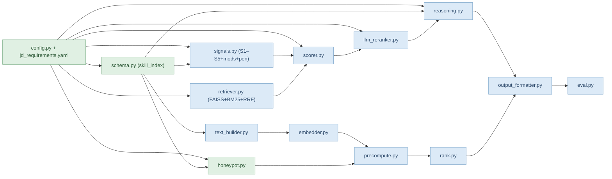
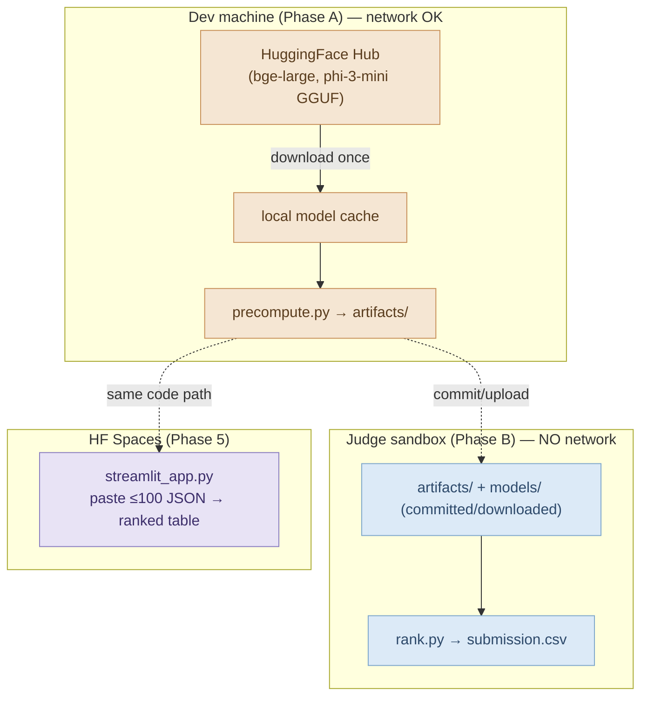

# 02 · Architecture

**Project:** Aptus-R (v5) · **Team:** Code Blooded
All diagrams are Mermaid (render in VS Code with the Mermaid extension and on GitHub).

---

## 2.1 Full pipeline (zoned, two-phase)

---

## 2.2 The timing budget (Phase B)

```mermaid
gantt
    title Phase B — 5-minute (300s) budget, adaptive
    dateFormat  X
    axisFormat %s
    section Load
    B1 load artifacts            :0, 20
    section Retrieve
    B2-B5 embed+FAISS+BM25+RRF    :20, 25
    section Score
    B6 score 500 pool            :25, 27
    section LLM (adaptive)
    B7 Phi-3-mini top-K          :27, 147
    section Assemble
    B8-B10 blend+template+write  :147, 157
    section Buffer
    headroom (143s)              :157, 300
```

> **Adaptive rule:** measure the first 3 LLM calls; if projected B7 end > 270s, shrink K (30→20→15→10).
> Never below 10 (NDCG@10 = 50% of score).

---

## 2.3 Scoring formula flow

---

## 2.4 Trap-defeat map

---

## 2.5 Component / module dependency graph

---

## 2.6 Deployment / runtime topology

---

## 2.7 Key architectural invariants

1. **The timed step does almost nothing heavy** — it loads artifacts and does matrix math + ≤30 LLM calls.
2. **No network symbol is importable** on the `rank.py` path (offline-test enforced).
3. **Every number is config-driven** — `jd_requirements.yaml` is the single source of truth.
4. **Every artifact length is asserted == 100000** at the end of Phase A.
5. **Determinism by construction** — fixed seeds everywhere; LLM at temp=0, 1 thread.
6. **Graceful degradation** — missing embedding artifact ⇒ retrieval falls back to BM25-only;
   LLM failure ⇒ composite + template reasoning.
