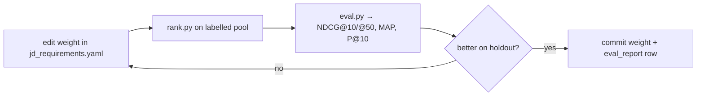

# 05 · Evaluation Framework (the G1 graft — the thing v4 was missing)

**Project:** Aptus-R (v5) · **Team:** Code Blooded
This is the single most important addition over v4. Without it we tune blind. With it, every weight
and the LLM decision are settled by a number.

---

## 1. Weak Ground Truth (WGT)

We have no labels, so we build our own.

### 1.1 Sampling — ~180 candidates, stratified
| Stratum | Count | Why |
|---|---|---|
| Rare senior ML/IR (Search, NLP, Recsys, Senior AI Eng) | 40 | the true positives — must rank these right |
| ML/AI (ML Eng, Data Scientist, CV Eng) | 40 | strong-but-imperfect band |
| Data/analytics (Data Analyst, Backend, Sr SWE) | 35 | the "adjacent" boundary |
| General SWE (Frontend, Java, QA, DevOps) | 35 | should rank low |
| Non-technical + known stuffers/honeypots | 30 | must rank near-zero; tests trap defence |

### 1.2 Label scale (0–3), JD-derived rubric
| Score | Meaning |
|---|---|
| **3 — strong fit** | right trajectory + deep skills + product company + available + India + short notice |
| **2 — plausible** | strong technically, one real gap (dormant / consulting-only / international / long notice) |
| **1 — weak/adjacent** | transferable signal, no direct ML/IR production evidence |
| **0 — not a fit** | non-technical, honeypot-shaped, or core JD disqualifier |

### 1.3 Protocol (defensible at Stage 5)
1. Two labellers independently score the same 60-candidate calibration subset.
2. Compute inter-rater agreement (Cohen's κ); discuss disagreements; record resolutions in
   `labeling_rubric.md`.
3. Split remaining labels; one labeller each, spot-checked.
4. **70/30 split:** ~126 for tuning, ~54 as a held-out set never used for tuning.
5. Output: `eval/gold_set.csv` columns `candidate_id, relevance`.

---

## 2. Metrics (`eval.py`)

| Metric | Definition | Weight in challenge |
|---|---|---|
| **NDCG@10** | normalized discounted cumulative gain, top 10 | 0.50 |
| **NDCG@50** | same, top 50 | 0.30 |
| **MAP** | mean average precision (relevance ≥2 = relevant) | 0.15 |
| **P@10** | precision at 10 (relevance ≥2) | 0.05 |
| **honeypot_rate** | fraction of top-100 in `honeypot_ids` | gate (must be 0; max 10) |

`composite_challenge = 0.50·NDCG@10 + 0.30·NDCG@50 + 0.15·MAP + 0.05·P@10`.

NDCG uses `sklearn.metrics.ndcg_score`; MAP/P@10 hand-implemented with a fixture-tested helper
(`test_eval.py`).

---

## 3. Baselines for ablation (FR-25)

Run every metric for four rankers and report side-by-side in `eval_report.md`:

| Ranker | Purpose |
|---|---|
| **Naive** (AI-skill-count × response-rate) | the `sample_submission.csv` trap — quantify how much we beat it |
| **Title-only** (rank by role tier) | isolates what the other signals add beyond title |
| **Composite** (S1–S5, no LLM) | the deterministic core |
| **Composite + LLM blend** | the full system |

> The deck's "Results" slide is literally this table.

---

## 4. The two decision rules (de-risk the LLM — G4)

### Decision Rule 1 — LLM weight is earned, not assumed
Evaluate three blends on the **held-out 30%**:
```
w = 1.00  (composite only)
w = 0.70  (LLM as tiebreaker)
w = 0.40  (v4's default, LLM-dominant)
```
**Ship the smallest (1−w) that maximises NDCG@10 on the holdout.** Tie or no clear win → prefer the
composite (lower variance, faster, deterministic). Record the chosen `w` and the numbers in
`eval_report.md`.

### Decision Rule 2 — LLM timing is measured, not assumed
At Phase B start, time the first 3 LLM calls. Project total B7 = `mean × K`. If
`elapsed + projected_B7 + 15s assemble > 290s`, shrink `K`: 30 → 20 → 15 → 10. **Never below 10**
(NDCG@10 = 50% of score). Log the chosen K.

---

## 5. Tuning loop (Phase 4)



Rules of the loop:
- Change **one** weight per iteration (attributable deltas).
- Only the **tuning split** drives changes; the **holdout** is read once at the end to report honest
  generalization.
- Every accepted change is a git commit referencing the eval delta (see [06_git_strategy.md](./06_git_strategy.md)).

---

## 6. `eval_report.md` format (committed, grows over time)

```
| date  | change                        | NDCG@10 | NDCG@50 | MAP  | P@10 | honeypot |
|-------|-------------------------------|---------|---------|------|------|----------|
| 06-19 | composite baseline            | 0.612   | 0.640   | 0.55 | 0.60 | 0/100    |
| 06-19 | +salary_mod                   | 0.631   | 0.652   | 0.57 | 0.60 | 0/100    |
| 06-20 | S2 multi-anchor (was 1 string)| 0.704   | 0.681   | 0.63 | 0.70 | 0/100    |
| 06-20 | +LLM blend w=0.40             | 0.689   | 0.679   | 0.62 | 0.70 | 0/100    | ← rejected (worse than w=1)
| 06-20 | +LLM blend w=0.70             | 0.731   | 0.690   | 0.64 | 0.80 | 0/100    | ← SHIP
```

This table *is* the Stage-5 defense: every decision has a measured before/after.

---

## 7. Honeypot calibration (closes F10)

Beyond the terminal assertion, during tuning we check the 6 rules against the labelled set:
- Any label-0 honeypot the rules miss → tighten that rule.
- Any label-3 real candidate the rules flag → loosen / add a guard.
Goal: 0 false-negatives on the labelled honeypots, minimal false-positives on label-3s.
