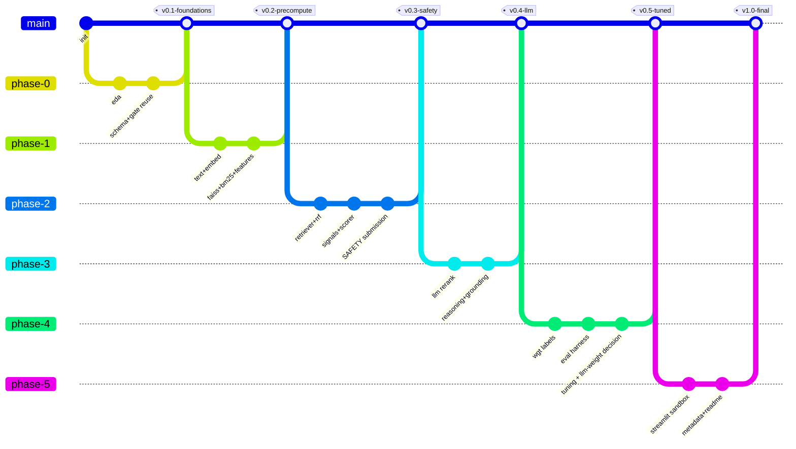

# 06 · Git Strategy & Version History

**Project:** Aptus-R (v5) · **Team:** Code Blooded
Git history is graded (Stage 3 reproducibility/authenticity). It must read like real iteration, not a
single code dump. This doc defines branches, commit conventions, tags, and the planned milestone
history.

---

## 1. Repository init

```bash
git init
git branch -M main
git remote add origin git@github.com:code-blooded/aptus-r.git
# .gitignore: .venv/, __pycache__/, *.pyc, data/candidates.jsonl.gz (large), models/*.gguf (large)
```

**Large files:** the raw dataset and the GGUF model are git-ignored. Artifacts are either committed
(if < 100 MB after compression) or reproduced via `precompute.py` + a documented download script.
FAISS index (~3 GB) is **not** committed — `precompute.py` rebuilds it; `submission_metadata.yaml`
declares this.

---

## 2. Branching model (lightweight, 3 people, 4 days)



- `main` is always runnable (after `v0.3` it always produces a valid CSV).
- One short-lived branch per phase; merge with a tag at the phase's Definition of Done.
- Each teammate works on their owned modules to avoid conflicts (PRD §7 ownership).

---

## 3. Commit message convention

```
<type>(<scope>): <imperative summary>

<body: what & why, reference eval delta if scoring-related>
```

**Types:** `feat`, `fix`, `perf`, `eval`, `docs`, `test`, `chore`, `data`.
**Scopes:** `schema`, `honeypot`, `retriever`, `signals`, `scorer`, `llm`, `reasoning`, `eval`,
`config`, `sandbox`.

**Examples**
```
feat(retriever): add RRF fusion of FAISS+BM25, pool=500
eval(signals): S2 multi-anchor lifts NDCG@10 0.631→0.704 on tuning split
fix(llm): pin temp=0/seed=42/n_threads=1 for deterministic decode
config(scorer): set llm blend w=0.70 per Decision Rule 1 (holdout 0.731)
```

Scoring-related commits **must** cite the eval delta — this is the audit trail for Stage 5.

---

## 4. Tags (one per phase milestone)

| Tag | Cut when | Guarantees |
|---|---|---|
| `v0.1-foundations` | Phase 0 DoD | repo, env, EDA, schema+gate reused & tested |
| `v0.2-precompute` | Phase 1 DoD | all artifacts build; FAISS returns sane ML engineers |
| `v0.3-safety` | Phase 2 DoD | **valid 100-row CSV passes validator (non-LLM)** |
| `v0.4-llm` | Phase 3 DoD | full pipeline < 5 min; deterministic; reasoning grounded |
| `v0.5-tuned` | Phase 4 DoD | WGT + eval; weights & LLM-weight chosen by measurement |
| `v1.0-final` | Phase 5 DoD | sandbox live; metadata + README; final validated run |

`v0.3-safety` is the insurance policy — if later phases break, we can submit this tag.

---

## 5. Submission tags

The hackathon allows up to 3 submissions; last valid counts.

| Submission | Source tag | When |
|---|---|---|
| S1 (format-proof) | `v0.3-safety` | end of Phase 2 |
| S2 (full model) | `v0.5-tuned` | end of Phase 4 |
| S3 (final) | `v1.0-final` | end of Phase 5 |

Each submission commit is tagged `submission-S1/2/3` and records the produced `submission.csv` SHA-256
in the commit body for traceability.

---

## 6. PR / review discipline (even solo merges)

- Phase branch → `main` via a short PR description listing: what changed, eval delta, tests run.
- No merge to `main` unless `pytest` passes and (post-`v0.3`) `rank.py` produces a valid CSV.
- `eval_report.md` updated in the same PR as any weight change (TRD NFR-8).

---

## 7. Reproducibility guarantees in history

- `requirements.txt` pinned from the first real commit; never floats.
- `submission_metadata.yaml` lists: declared offline precompute steps, model list + sources, the
  exact reproduce command, and which artifacts are committed vs rebuilt.
- A `determinism` CI-style check (`test_determinism.py`) runs before each submission tag.

---

## 8. What the history proves to judges

1. **Authentic iteration** — EDA precedes design; honeypot detector precedes scorer; eval precedes
   tuning. The order tells a true engineering story.
2. **Measured decisions** — scoring commits cite NDCG deltas; the LLM weight is a logged choice.
3. **Always-shippable main** — the `v0.3-safety` tag means we were never at risk of a format DQ.
